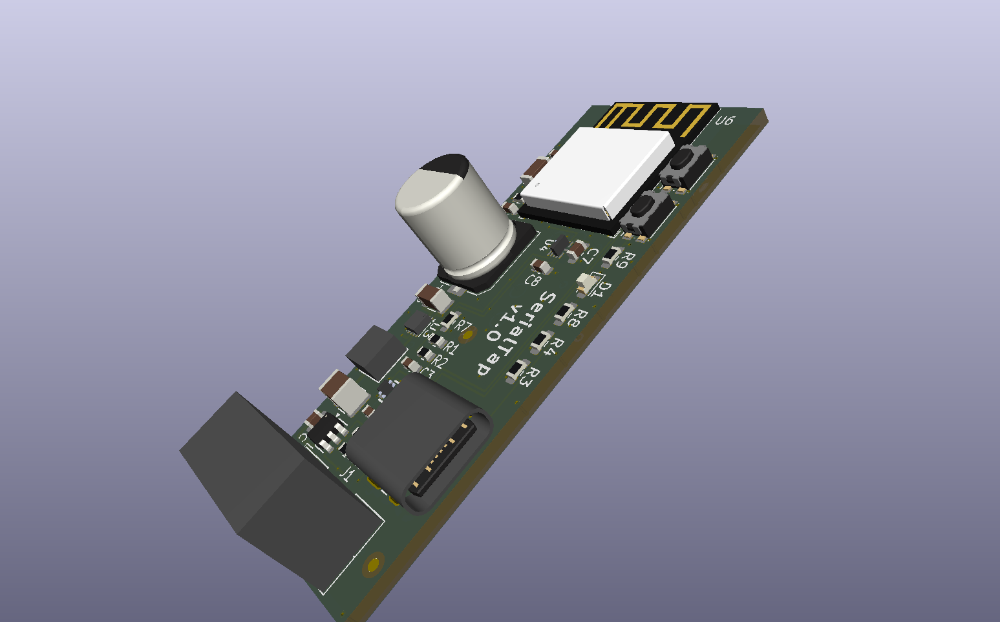

# SerialTap

An open-hardware board that puts an appliance's 5 V serial service port on
Home Assistant. An ESP32-C3 with level translation, powered by the appliance
itself: one 4-wire cable carries 5 V, GND, TX and RX.



The reference target is a **Haier AS50QDFHRA** split-system air conditioner,
whose service port speaks GE Appliances **GEA3** at 230400 8N1
([docs/gea3.md](docs/gea3.md)). The board is not specialised to it: any
appliance exposing 5 V and a UART on a service connector is in scope.

## Status

**Version 1.0 has been sent to PCBWay; no board has been built yet.** The
`v1.0` tag marks the sources the order was built from.

Every design stage is done: power-path simulation, parts, library, schematic,
layout and three review gates. What is still owed is measurement on the real
appliance: the rail's current has so far been inferred, not measured
([ADR 0007](docs/adr/0007-rail-limit-inferred-not-measured.md)).

## The board

- **22 × 54 mm, 4-layer**, single-sided assembly, no mounting holes. It keeps
  the OEM module's outline and sits in its slot.
- **ESP32-C3-MINI-1** module. Programming and logs go over its built-in USB on
  a USB-C connector, so the appliance UART is never shared with logging.
- **Fixed-direction level translation** (TXU0204) between the 3.3 V module
  and the 5 V port, behind ESD protection and series resistors.
- **Power** from either the appliance or USB-C, ideal-diode OR-ed, through a
  current-limited eFuse and a 470 µF polymer bulk capacitor into a
  synchronous buck (TPS62162).

Service connector, as fitted to the reference appliance:

| Pin | 1 | 2 | 3 | 4 | 5 |
|---|---|---|---|---|---|
| Signal | 5 V | TX (board drives) | RX | spare (unknown) | GND |

## Where to start

| To understand… | Read |
|---|---|
| The vocabulary | [CONTEXT.md](CONTEXT.md) |
| The design, end to end | [docs/SPDD.md](docs/SPDD.md) |
| Why it is this way | [docs/adr/](docs/adr/): seven decisions, each with its context and what would reverse it |
| The protocol | [docs/gea3.md](docs/gea3.md) |
| How the schematic was checked | [docs/schematic-capture.md](docs/schematic-capture.md) |
| Layout rules and review gates | [docs/layout-rules.md](docs/layout-rules.md) |
| Parts and sourcing | [bom/README.md](bom/README.md) |
| Power-path simulation | [sim/README.md](sim/README.md) |
| Bring-up and measurement | [docs/bench-plan.md](docs/bench-plan.md), [docs/bench-results.md](docs/bench-results.md) |

## Repository layout

```
pcb/     KiCad 10 project: serialtap.kicad_sch / .kicad_pcb / .kicad_pro
lib/     the project's own symbols, footprints, 3D models and datasheets
sim/     LTspice power-path decks and their results
bom/     bill of materials and sourcing notes
docs/    design document, ADRs, protocol, layout and bench notes
bench/   capture and analysis scripts, and the ESPHome config used on the bench
```

## Opening and checking the design

Open `pcb/serialtap.kicad_pro` in **KiCad 10**. Everything it references is
in `lib/` through `${KIPRJMOD}`-relative paths, so it needs no global library.

```sh
CLI=/Applications/KiCad/KiCad.app/Contents/MacOS/kicad-cli   # macOS path
"$CLI" sch erc pcb/serialtap.kicad_sch
"$CLI" pcb drc --schematic-parity pcb/serialtap.kicad_pcb
```

The simulations need LTspice and vendor models that are not redistributed
here; [sim/README.md](sim/README.md) explains how to get them.

Fabrication outputs are regenerated rather than committed. Each fab order is
tagged, so a physical board traces back to its sources.

## Licence

Hardware under **CERN-OHL-P v2**; firmware and documentation under **MIT**.
Both are permissive. [NOTICE](NOTICE) sets out which files fall under which,
and the third-party material that falls under neither.
